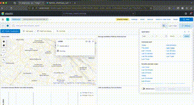

# 🚲 Prédiction de la Disponibilité des Vélib' avec Airflow, Spark et Elasticsearch




## 📌 Description
Ce projet a pour but de **prédire la disponibilité des Vélib'** en utilisant :
- **Airflow** 🌀 pour orchestrer les tâches ETL.
- **Spark ML** 🔥 pour entraîner un modèle de prédiction.
- **Elasticsearch & Kibana** 📊 pour stocker et visualiser les résultats.

## 🏗 **Architecture du Projet**
1. **Ingestion des données**
   - API **Vélib' Métropole** (disponibilité des stations).
   - API **Open-Meteo** (météo actuelle et prévisions).
   - Stockage des données brutes sur **Localstack S3** (`s3a://my-bucket/raw/`).
   
2. **Transformation des données**
   - Nettoyage et mise au format Parquet (`s3a://my-bucket/fmt/`).
   - Agrégation des données (`s3a://my-bucket/agg/`).

3. **Modélisation Machine Learning**
   - Régression linéaire avec **Spark ML** pour estimer les vélos disponibles.
   - Entraînement stocké sur **Localstack S3** (`s3a://my-bucket/models/`).

4. **Prédictions & Indexation**
   - Prédictions pour les prochaines 24h 🔮.
   - Stockage des résultats dans **Elasticsearch** (`index: velib_predictions`).

# 📊 Importer le Dashboard Kibana

Vous pouvez facilement importer le dashboard prédéfini en utilisant le fichier `kibana_dashboard.ndjson`.


---

## 🚀 **Démarrer le Projet en Local (Docker)**
### 1️⃣ **Lancer les Conteneurs**
```bash
docker compose up -d --build
```

### 2️⃣ **Vérifier que les services tournent**
```bash
docker compose ps
```

- Stockage des résultats dans **Elasticsearch** 
Tu dois voir Airflow, Spark, Elasticsearch et Kibana actifs.

### 3️⃣ **Accéder aux Interfaces**

| Service        | URL d'accès                          |
|---------------|-------------------------------------|
| **Airflow**   | [http://localhost:8080](http://localhost:8080) |
| **Kibana**    | [http://localhost:5601](http://localhost:5601) |
| **Elasticsearch** | [http://localhost:9200](http://localhost:9200) |


## 🔥 Pipeline Airflow (DAGs)

Les tâches Airflow s'exécutent automatiquement.

### 1️⃣ Liste des DAGs

#### `etl_pipeline` : Exécution toutes les 10 minutes
- **Ingestion** → APIs Vélib’ et météo
- **Transformation** → Nettoyage et mise en Parquet
- **Agrégation** → Fusion des données
- **Indexation Elasticsearch** → Affichage dans Kibana

#### `fetch_station_info` : à minuit le 1er janvier de l'an
- **Update_station_info** → APIs Vélib’ 


#### `predict_bike_availability` : Chaque heure
- **predict_bike_availability** → prédit les nombres de vélos disponibles


#### `train_model` : à 12h
- **train_model** → Entraine le modèle


## 🤝 Contribuer

📌 **Pull Requests et suggestions bienvenues !**

1️⃣ **Forker le repo** 📌  
2️⃣ **Créer une branche `feature/mon-amélioration`**  
3️⃣ **Proposer un Pull Request** 🚀  

---

### 📝 TODO

✅ **Prédictions en temps réel avec Kafka**  
✅ **Ajouter une API météo plus précise**  
✅ **Ajouter Grafana pour d'autres visualisations**  
✅ **Déployer sur AWS/GCP**  

---

### 💡 Auteur

👤 **Manoel Malaury** - [GitHub](https://github.com/TM-Squared)  
✉️ **Contact** : [manoel@malaurytoussi.cm](mailto:manoel@malaury.toussi.cm)  

---

🚀 **Enjoy & Keep Coding!** 😃
